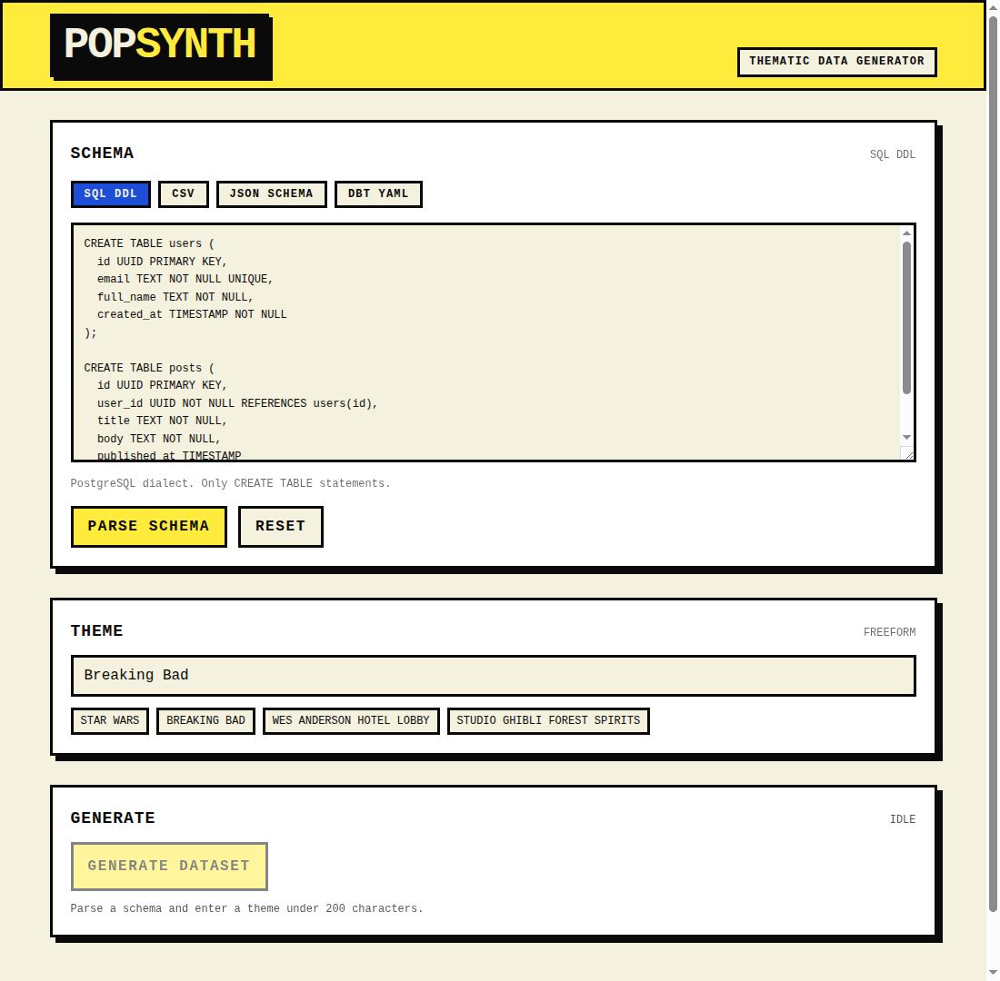

# Pop Synth

Pop Synth is a developer tool for generating themed synthetic data from a database-shaped schema. Use the web app to paste and edit a schema, or use the `popsynth` CLI to generate CSV files from scripts and CI workflows.



## Features

- Accept schema input as SQL DDL, CSV headers/sample rows, JSON Schema, or dbt YAML.
- Edit parsed tables, columns, primary keys, unique flags, enum values, and foreign keys before generating data.
- Enter one freeform theme for the whole dataset, capped at 200 characters.
- Choose per-table row counts from 1 to 200.
- Generate a compact LLM `GenerationPlan` with canonical entity pools, per-table roles, column mappings, and cross-column constraints.
- Stream rows over Server-Sent Events as they are generated.
- Preserve foreign-key integrity by attaching FK values deterministically from generated parent rows.
- Deduplicate unique columns and validate LLM outputs with Zod.
- Preview rows in fixed-height tables with per-table CSV copy buttons.
- Download generated CSV files as a zip.
- Install the CLI as an npm package and generate one CSV per table from the terminal.

## Schema Inputs

- **SQL DDL:** deterministic parsing of PostgreSQL-style `CREATE TABLE` statements. SQL is parsed only; it is never executed.
- **CSV:** first row is treated as headers, with up to three sample rows used for type inference. This path uses the planner LLM to infer a `SchemaIR`, so it requires `ANTHROPIC_API_KEY`.
- **JSON Schema:** deterministic parsing of a top-level object plus `$defs` or `definitions` entries.
- **dbt YAML:** deterministic parsing of `sources`, `models`, and `seeds` with column definitions and relationship tests.

## Safety And Limits

All user input is treated as untrusted data at LLM boundaries.

- Theme input is capped at 200 characters.
- Schema input is capped at 20,000 characters.
- Schema size is capped at 20 tables and 50 columns per table.
- Row generation is capped at 200 rows per table.
- Identifiers must be simple SQL identifiers: letters, numbers, and underscores, starting with a letter or underscore.
- Plans and generated rows are validated with Zod before downstream use.
- Foreign keys are assigned in code rather than trusted to the row-generation model.

## Tech Stack

- Next.js App Router
- TypeScript
- Vercel AI SDK with `@ai-sdk/anthropic`
- Zod
- `node-sql-parser`
- `js-yaml`
- `papaparse`
- Tailwind CSS

## Environment

For the web app, create `.env.local`. For the CLI, export the same variables in your shell:

```bash
ANTHROPIC_API_KEY=your_key_here
```

Optional model overrides:

```bash
ANTHROPIC_PLANNER_MODEL=claude-sonnet-4-6
ANTHROPIC_ROW_MODEL=claude-haiku-4-5
```

Defaults:

- Planner and CSV schema inference: `claude-sonnet-4-6`
- Row generation: `claude-haiku-4-5`

CLI flags `--planner-model` and `--row-model` override the environment for one run.

## CLI

Install from npm after publication:

```bash
npm i -g popsynth
```

Run without installing:

```bash
npx popsynth --help
```

Common workflows:

```bash
popsynth parse --schema schema.sql --schema-kind sql
popsynth plan --schema schema.sql --schema-kind sql --theme "Gotham logistics" --out plan.json
popsynth generate --schema schema.sql --schema-kind sql --theme "Studio Ghibli CRM" --out ./popsynth-output
```

Generation writes one CSV per table to `./popsynth-output` by default. It refuses to write into a non-empty directory unless `--force` is set.

Useful generation flags:

```bash
popsynth generate \
  --schema schema.sql \
  --schema-kind sql \
  --theme "Wes Anderson hotel lobby" \
  --rows 25 \
  --row users=10 \
  --save-plan plan.json \
  --schema-ir schema-ir.json \
  --json
```

`--plan plan.json` reuses an existing `GenerationPlan` and skips planning. Progress and warnings go to stderr; `--json` writes a machine-readable manifest to stdout. SQL input is parsed only and is never executed.

## Getting Started

Install dependencies:

```bash
pnpm install
```

Run the dev server:

```bash
pnpm dev
```

Open [http://localhost:3000](http://localhost:3000).

## Verification

```bash
pnpm lint
pnpm typecheck
pnpm --filter popsynth typecheck
pnpm test
pnpm build
pnpm pack:dry-run
```

## Roadmap

- JSON output.
- Postgres SQL INSERT output.
- Thematic generated README files for generated datasets.
- Per-table regeneration.
- Homebrew and standalone native binary distribution.
